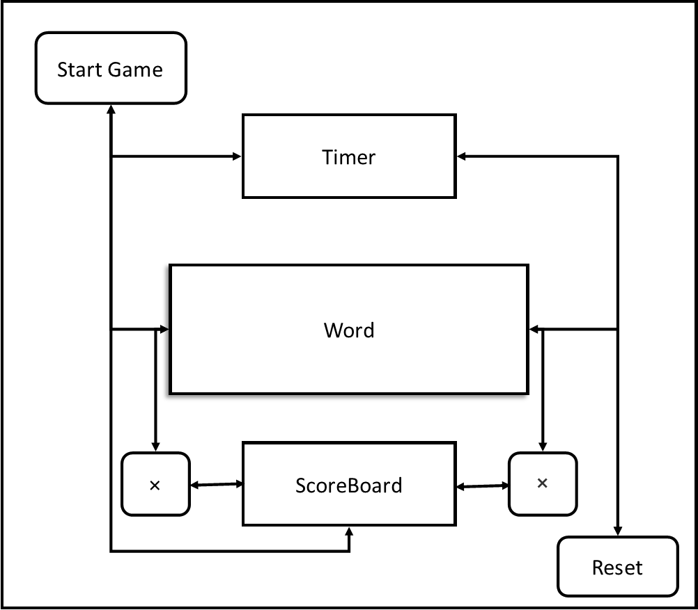

# BONGA KENYA
####  20/05/2020
#### By **Njoki, Edwin, Daisy, Elija and Wyclif**
## Description
Charades is a game in which players guess randomized words from a written or acted clue given to each at a given period of time.
The game's word bank includes landmarks, famous people, musicians, animals, cities and countries relevant to the Kenyan context.

## Live page
[Bonga Kenya Charades](https://njoki254.github.io/Bonga-Kenya/.)

## BDD

Bonga Kenya is here to make u play and make you learn more on our charades game.

# Game Instructions
1. Press "Start game" Button
2. Player who's turn it is should guess as many words as possible within the given time, without any verbal communication for clues
3. If player guesses a word correctly, the game conductor should press the check button to add a point to the ScoreBoard
4. If a player cannot guess the word  and wishes to pass, the game conductor presses the X button to move on to the next word
5. The reset button resets the timer

## Installation Requirements
* clone project from github [https://njoki254.github.io/Bonga-Kenya/.]
* navigate to the cloned project folder
* run index.html on your browser.

## Technologies Used
* HTML - structure web page
* CSS - to style web
* JQUERY - gives live links to the project
* JAVASCRIPT - to collect data
* Markdown

## license
* MIT
Copyright (c) 2020 ** Gwada Wyclif, Njoki Kamau, Daisy Kibogy, Elijah, Edwin**
Licensed under the Apache License, Version 2.0 (the "License"); 
